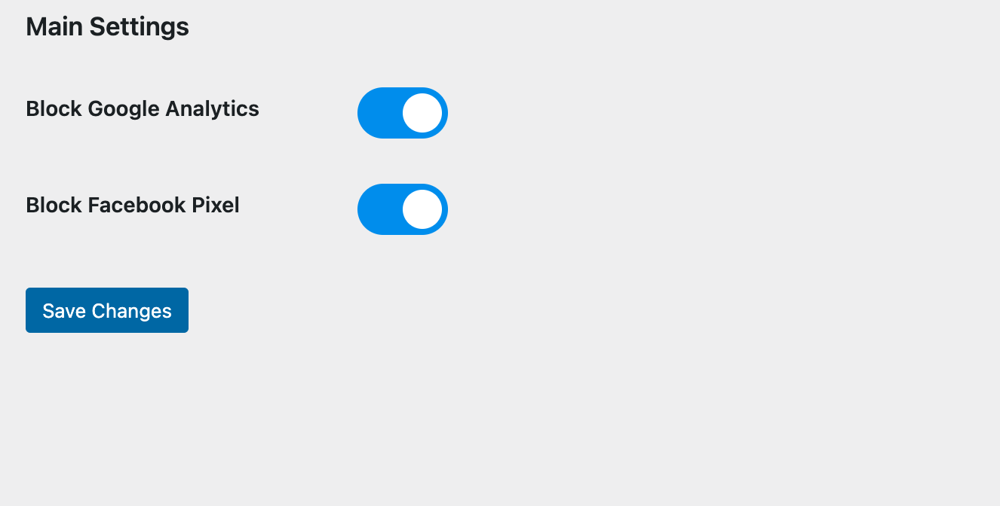

# GPC Detection

A WordPress plugin to detect and handle Global Privacy Control (GPC) signals. This plugin allows site administrators to block Google Analytics and Facebook Pixel based on the user's GPC preferences.

## Description

This plugin provides a settings page where administrators can choose to block Google Analytics and/or Facebook Pixel tracking scripts if the user's browser sends a GPC signal. The plugin uses JavaScript to dynamically block these scripts based on the configured settings.

## Installation

1. **Download the Plugin:**

    - Clone the repository or download the ZIP file.

2. **Upload to WordPress:**

    - Upload the plugin files to the `/wp-content/plugins/gpc-detection` directory, or install the plugin through the WordPress plugins screen directly.

3. **Activate the Plugin:**

    - Activate the plugin through the 'Plugins' screen in WordPress.

4. **Configure the Settings:**
    - Navigate to `Settings > GPC Detection` to configure the plugin.

## Usage

### Settings Page

The settings page provides options to block Google Analytics and Facebook Pixel tracking scripts:

-   **Block Google Analytics:** Toggle this setting to enable or disable blocking of Google Analytics.
-   **Block Facebook Pixel:** Toggle this setting to enable or disable blocking of Facebook Pixel.

### Toggle Switch Styling

The checkboxes on the settings page are styled as toggle switches using custom CSS.

## Development

### JavaScript

The plugin includes a JavaScript file (`js/gpc-detection.js`) that handles the blocking logic. It checks for the GPC signal and blocks the configured tracking scripts if enabled.

### CSS

Custom CSS for the toggle switches is included in the `css/toggle-switch.css` file.

### PHP

The main plugin file (`gpc-detection.php`) includes all the necessary functions to register settings, enqueue scripts, and render the settings page.

## Files

-   `gpc-detection.php`: Main plugin file.
-   `js/gpc-detection.js`: JavaScript file for blocking logic.
-   `css/toggle-switch.css`: CSS file for toggle switch styling.
-   `includes/updater.php`: Include file for plugin updates (if applicable).

## Screenshots

### Settings Page

## License

This project is licensed under the MIT License. See the [LICENSE](LICENSE) file for details.

## Author

-   **Angelo Marasa**

## Acknowledgments

-   Special thanks to the contributors and the WordPress community for their support and guidance.
